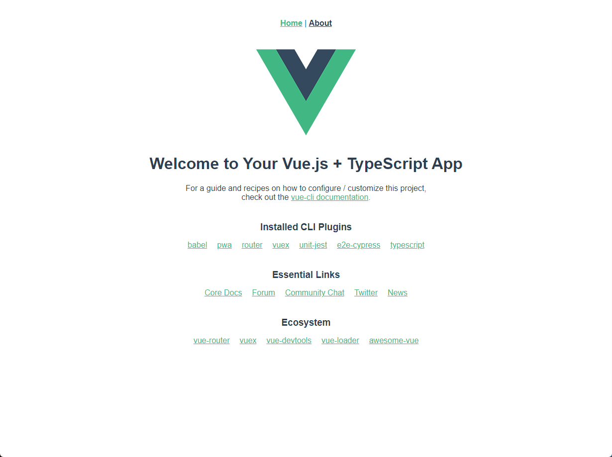

# 网易云音乐客户端播放器（PC） Online Music Player

## 技术栈

```js
@vue/cli 4.5.13
node v14.17.3
yarn v 1.22.11
```

```js
>(*) Babel                                 ☜(转码器，可以将ES6代码转为ES5代码)
 ( ) TypeScript                            ☜( js的超集，强类型语言)
 ( ) Progressive Web App (PWA) Support     ☜(渐进式Web应用程序)
 ( ) Router                                ☜(vue-router（vue路由）)
 ( ) Vuex                                  ☜(vuex（vue的状态管理模式）)
 ( ) CSS Pre-processors                    ☜(CSS 预处理器（如：less、sass）)
 (*) Linter / Formatter                    ☜(代码风格检查和格式化（如：ESlint）)
 ( ) Unit Testing                          ☜(单元测试)
 ( ) E2E Testing                           ☜(集成测试)
```

- Vue CLI: Manually select features(Choose Vue version, Babel, TypeScript, Progressive Web App(PWA) Support, Router, Vuex, CSS Pre-processors, Linter / Formatter, Unit Testing, E2E Testing)
- Vue2.x, Use class-style component syntax
- Use Babel alongside TypeScript (required for modern mode, auto-detected polyfills, transpiling JSX)
- Use history mode for router
- Sass/SCSS(with dart-sass) 性能更好

```js
> Sass/SCSS (with dart-sass)   ☜(保存后编译)
 Sass/SCSS (with node-sass)    ☜(实时编译)
```

- Pick a linter / formatter config: TSLint

```js
> ESLint with error prevention only                 ☜(只进行报错提醒)
 ESLint + Airbnb config                             ☜(不严谨模式)
 ESLint + Standard config                           ☜(正常模式)
 ESLint + Prettier                                  ☜(严格模式)
 TSLint (deprecated)                                ☜(typescript格式验证工具)
```

```js
>(*) Lint on save                                    ☜(保存就检测)
( ) Lint and fix on commit                          ☜(fix和commit时候检测)
```

- Pick a unit testing solution: Jest

```js
? Pick a unit testing solution
>(*) Mocha + Chai           ☜(mocha灵活,只提供简单的测试结构，如果需要其他功能需要添加其他库/插件完成。必须在全局环境中安装)
( ) Jest                    ☜(安装配置简单，容易上手。内置Istanbul，可以查看到测试覆盖率，相较于Mocha:配置简洁、测试代码简洁、易于和babel集成、内置丰富的expect)
```

- Chrome

```js
> In dedicated config files   ☜(独立文件放置)
 In package.json              ☜(放package.json里)
```

## 截图



```js
"dependencies": {
  "core-js": "^3.6.5",
  "register-service-worker": "^1.7.1",
  "vue": "^2.6.11",
  "vue-class-component": "^7.2.3",
  "vue-property-decorator": "^9.1.2",
  "vue-router": "^3.2.0",
  "vuex": "^3.4.0"
},
"devDependencies": {
  "@types/jest": "^24.0.19",
  "@vue/cli-plugin-babel": "~4.5.0",
  "@vue/cli-plugin-e2e-cypress": "~4.5.0",
  "@vue/cli-plugin-pwa": "~4.5.0",
  "@vue/cli-plugin-router": "~4.5.0",
  "@vue/cli-plugin-typescript": "~4.5.0",
  "@vue/cli-plugin-unit-jest": "~4.5.0",
  "@vue/cli-plugin-vuex": "~4.5.0",
  "@vue/cli-service": "~4.5.0",
  "@vue/test-utils": "^1.0.3",
  "sass": "^1.26.5",
  "sass-loader": "^8.0.2",
  "typescript": "~4.1.5",
  "vue-template-compiler": "^2.6.11"
}
```

## 在现有的项目中安装插件

每个 CLI 插件都会包含一个 (用来创建文件的) 生成器和一个 (用来调整 webpack 核心配置和注入命令的) 运行时插件。

## 进度

- [x] mv 页
- [x] cd 页
- [x] 搜索建议
- [x] 搜索详情
- [x] 播放（版权歌曲无法播放)
- [x] 发现页
- [x] 播放列表
- [x] 播放记录
- [x] 全部歌单
- [x] 歌单详情
- [x] 最新音乐
- [x] 主题换肤功能
- [x] 登录(网易云 uid 登录)

## 后端接口

https://neteasecloudmusicapi.vercel.app/#/

## 魔改

- **_Vue_** 全家桶 通过 Vue-CLI3 初始化生成。
- **_ElementUI_** 魔改样式。
- **_better-scroll_** 歌词滚动部分用了黄轶老大的 （贼爽）
- **_CSS Variables_** 主题换肤。
- **_ESNext_** （JavaScript 语言的下一代标准）
- **_Sass_**（CSS 预处理器）
- **_postcss-pxtorem_**（自动处理 rem，妈妈再也不用担心屏幕太大太小了）
- **_workbox-webpack-plugin_** 谷歌开发的利用 Service Worker 实现页面预缓存的插件。

## Screenshots


## 安装与使用

```
yarn install
yarn serve
```

## License
